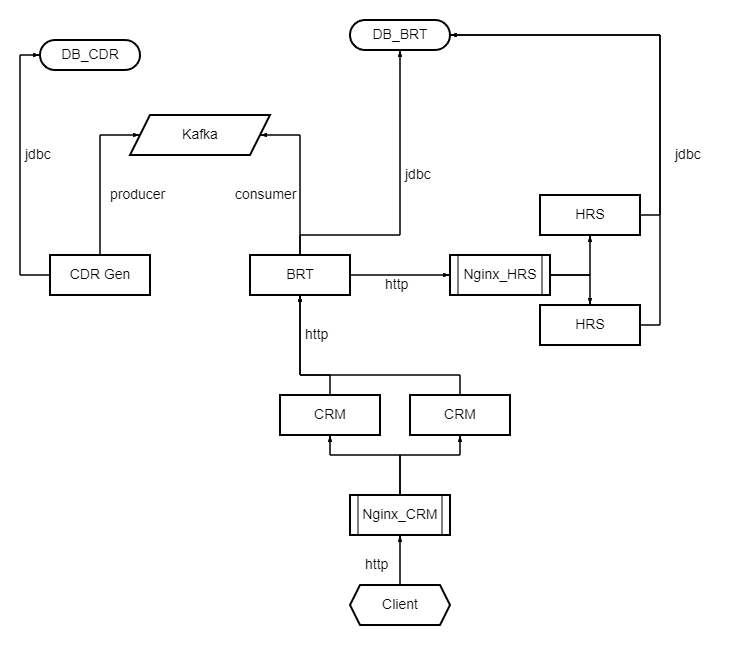
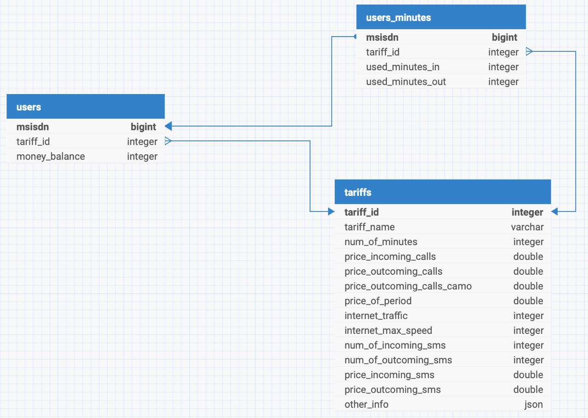

# README

# Запуск

Для запуска проекта клонируем/качаем себе этот репозиторий и ставим Docker Desktop и WSL

1. [https://www.docker.com/products/docker-desktop/](https://www.docker.com/products/docker-desktop/)
2. [https://learn.microsoft.com/ru-ru/windows/wsl/install](https://learn.microsoft.com/ru-ru/windows/wsl/install)

Далее открываем терминал в корне (там где лежит **docker-compose.yml**) и прописываем следующие команды

```powershell
docker-compose build
docker-compose up
```

Изменение кода сервисов требует повторной сборки **docker-compose**

---

---

# Запуск сервисов в ручном режиме

Я абсолютнейше не уверен в корректности сборки контейнеризированного решения, поэтому прикрепляю ссылку на более простой для когнитивного восприятия репозиторий

[https://github.com/GrishaRubitel/NexignBootcampProj](https://github.com/GrishaRubitel/NexignBootcampProj)

Этот проект открывается в любой удобной IDE и там же дебажится, однако для запуска PSQL и Kafka  docker-compose всё таки понадобится

---

---

# Описание проекта



Схема взаимодействия сервисов

---

### Базы данных

Как видно из схемы, мы имеем дело с **двумя базами данных** - одна хранит информацию для работы CDR и генерации звонков, а другая информацию о тарифах и абонентах оператора “Ромашка”, а также определенную служебную информацию; со второй базой данных работают сервисы BRT и HRS.

**Причина**, по которой BRT и HRS работают с одной базой данных, будет описана далее в **нюансах разработки**.

Обращение к БД происходит посредством **ORM**, так что никакие вредные **SQL-инъекции** нам не страшны.

---

### Kafka

В задачах проекта было реализовать **брокер сообщений Kafka**. При его помощи удалось наладить “общение” между микросервисами CDR и BRT. **Изначально** в планах разработки была реализация Кафки между BRT и HRS, но позже на место Кафки пришёл протокол **HTTP.**

Кафка сконфигурирована достаточно просто - **два брокера** лишь с **одним топиком** на одну партицию. Этих “магистралей” более чем достаточно для нашей скромной работы.

---

### HTTP

Передача информации на уровне **HTTP** реализована не только на уровне клиентских обращений, но и на **межсервисном уровне**. 

Таким образом происходит общение между BRT и HRS, CRM и BRT, а также CDR и CRM.

Последние “общение” реализовано с целью эмуляции клиентских обращений.

---

### Nginx

Если мы предполагаем, что мы разрабатываем сервис, который будет работать на реальном продакшене, то мы должны предусмотреть распределение нагрузки между сервисами, а также отказоустойчивость. С такими задачи справляется абсолютно необязательный для проекта Nginx. 

Конкретно в этой работе он занимается лишь **переадресацией HTTP запросов** на подопечные ему сервисы (CRM и HRS). Стоит также отметить, что все запросы направляются именно в Nginx, где сконфигурирован **proxy сервер**. 

**Важное слово от разработчик!** *В репозитории с контейнеризацией я навыкаблучивался с Nginx’ом и словил какой-то баг - CDR по какой-то причине не может отправить запрос на CRM или Nginx. В, так скажем, dev-версии проекта этот баг устранён (хотя код там идентичный). Однако обращения через Swagger или Insomnia проходят*

---

### CDR

Этот сервис занимается параллельной **генерацией** звонков, а точнее **записей о звонках**.

Сервис хранит в себе какой-то список объектов (класс AbonentHolder), генерирует какое-то число от 0 до 1, и если число больше какой-то константы (по умолчанию 0.7), то происходит генерация звонка. Такой “бросок кубика” происходит раз в 300 миллисекунд, просто чтобы уследить глазами за ходом работы сервиса.

Стоит сказать про класс AbonentHolder. Этот класс хранит номер телефона абонента, а также время окончания последнего звонка. Для чего это нужно: когда мы выбираем двух абонентов и начинаем подбирать им время начала звонка, мы можем столкнуться с проблемой генерации параллельных звонков, когда, допустим, один абоненты совершает два звонка в одно и то же время. Именно здесь нас выручает класс AbonentHolder, так как мы за время начала звонка берем большее время этих двух абонентов.

Проверить параллельности звонков можно при помощи простого PSQL скрипта - если разница во времени положительная - параллельности нет.

```sql
select msisdn, msisdn_to, unix_start, unix_end, lag(unix_start) over (partition by msisdn order by unix_start desc) - unix_end as call_len
from transactions t
order by msisdn, unix_start asc
```

**Про параллельный доступ**

Сервис все сгенерированные записи складывает в один единый список. Но так как у нас может быть как один, так и два потока генерации (делать больше потоков я посчитал бессмысленным), нужно обеспечить конкурентный доступ к списку.

Поэтому список это не список, а класс со списком (ConcurentRecordHolder). Однако в этом классе реализованы методы конкурентного доступа к этому с списку. Первый поток, который доберётся до списка, закроет его для чтения и записи для всех остальных потоков. И когда этот добравшийся поток закончит все свои дела, он откроет доступ к списку для всех остальных потоков.

**Отправка в Кафку**

Когда список дойдёт до объёма в 10 сгенерированных записей, всё его содержимое будет отправлено к Кафку, после чего список будет очищен

**Запуск генерации**

В момент запуска сервиса ничего не происходит, поэтому в “точке входа” вызывается instance микросервиса, через которую запускается генератор

**Рандом**

CDR имеет в себе метод, который позволяет создавать и отправлять запросы к CRM. Этот метод срабатывает, если у нас "не выпадает" генерация звонка, а выпадает другая, нужная нам для генерации запроса.
Шанс генерации звонка - 30%. Шанс генерации рандомного запроса - 10%

---

## BRT

В отличие от CDR, где вызывается instance, запускающая генератор, BRT просто висит и слушает Кафку. Когда в нужный топик попадает новый файл BRT его отлавливает и начинает его обработку.

Отловленный CDR файл полностью читается, заносится в список и сортируется по возрастанию времени окончания звонка.

Список хранит не голые записи, а объекты класса **BrtTransaction**, таким образом мы облегчаем себе задачу написания кода и обработки звонков. Также на этапе формирования списка мы отфильтровываем записи, первый абонент которых не является абонентом “Ромашки”.

Также у класса **BrtTransaction** есть boolean поле **inNet,** которое отвечает за звонок внутри сети.

Когда список записей окончательно формируется, сервис начинает его читать. Запись парсится в JSON, который позже по протоколу HTTP отправляется в HRS, а BRT начинает ждать ответ в формате JSON, где будут номер телефона абонента и количество средств, которое надо списать с его счёта.

**Определение месяца**

Сервис имеет **стэк** с временными метками начала новых месяцев. Этот стек заполняется **пре-конструктором** ещё до начала работы сервиса. Если, во время чтения записей и их отправки, сервис находит, что время конца звонка приходится на новый месяц, путём сравнения вершины стека с временной меткой, то сервис вызывает метод ежемесячного списания средств.

У сервиса есть список абонентов, который также заполняется внутри **пре-конструктора** (так в рамках нашей работы, когда абонентов немного, мы избавляемся от необходимости лишний раз ходить в базу данных). Если у абонента тариф с ежемесячной платой, то мы отправляем информацию о его номере телефона и тарифе на HRS, для последующего списания средств.

**Работа с клиентом**

Помимо BRT, CDR и HRS, у нас также есть сервис для клиентского взаимодействия **CRM**. Но так как он не имеет доступа к базе данных ромашки, любой запрос из CRM должен перенаправляться в BRT.

Так как в наших условиях завести в проект протокол HTTPS или JWT токены является проблемой, в междусервисном общении реализуется процесс инкапсуляции и декапсуляции пакетов, небольшая аналогия с процессом коммутации. 

Любому запросу от CRM присуждается “кастомный” заголовок с каким-то текстом, который знают оба сервиса, и если этот заголовок совпадает, то мы верим источнику запроса и начинаем обработку запроса.

**API**

BRT имеет те же самые API что и CRM, однако логика другая. Если CRM авторизует запросы, то BRT их обрабатывает, будь то просто выдача информации из БД, или модификация или внесение информации. При отправки инaормации на HRS BRT, как и CRM, подставляет в запрос свои идентифицирующие заголовки, чтобы HRS могу поверить отправителю.

---

## HRS

HRS - наш третий сервис, он занимается математикой и вычислением стоимостей звонков и ежемесячных списаний. У него есть набор API, который позволяет получать информацию от BRT. У HRS, как было сказано выше, есть доступа к базе тарифов, почему это сделано именно таким образом можно почитать в нюансах принятых решений.

У HRS есть своя таблица в базе данных, в которой хранятся абоненты с тарифами, которые подразумевают какое-то количество бесплатных минут. Эта таблица - счётчик наговоренных минут. Если количество минут в таблице достигло максимума, относительно своего тарифа, HRS производит расчёт по стандартному тарифу.

---

## CRM

Последний сервис из всей плеяды. Он отвечает за клиентские обращения, будь то запрос данных об абоненте или внесение платы. Главная задача сервиса - пустить или не пропустить. Если CRM считает заголовки запроса корректными, то сервис подставляет свой сигнатурный заголовок и отправляет его на BRT.

Если же CRM получает отрицательный ответ от BRT, то сервис подменяет ответ на тот, который можно показать пользователю, например “Повторите позже”. Это нужно чтобы не показывать клиенту служебную информацию.

---

---

# Нюансы принятых решений

В процессе проектирования базы данных для нашего проекта, было принято решение создать две базы: одна для CDR, вторая для HRS и BRT.

В практическом задании к проекту предполагалось хранение данных о тарифах оператора в базе BRT таким образом, чтобы HRS не имело к ним доступа. Такое решение показалось нашей команде не совсем логичным. BRT нет необходимости иметь доступ ко всей информации о тарифе, кроме как к ID тарифа. В то же время HRS имеет такую необходимость, поскольку выполняет рассчитывает сумму списания.

Также можно сказать, что мы распределяем нагрузку при обращении к базе данных. Так как в нашем конкретном случае, BRT является центром всех операций, а HRS лишь “занимается математикой”. И более того, в нашем сервисе “крутится” две копии HRS, нагрузка на которые распределяется при помощи Nginx.

При этом базы данных HRS и BRT объединены для сохранения целостности данных (мы не храним две записи о каком-то конкретном тарифе в двух разных БД).

Основное решение реализовано по такой логике. Но в случае необходимости, существует ещё одна версия проекта, где HRS не имеет доступа к базе данных BRT - [https://github.com/GrishaRubitel/NexignBootcampProj/tree/ZeroSqlHrs](https://github.com/GrishaRubitel/NexignBootcampProj/tree/ZeroSqlHrs)

---

## Схемы баз данных Postgres

.jpg)

База данных CDR



База данных BRT/HRS

---

---

# Ссылки на Swagger UI

**Контейнеризированное решение**

**CRM** - [http://localhost:9989/swagger-ui/index.html#/](http://localhost:9989/swagger-ui/index.html#/)

**HRS** -  [http://localhost:9999/swagger-ui/index.html#/](http://localhost:9989/swagger-ui/index.html#/)

Dev-версия

CRM - [http://localhost:8082/swagger-ui/index.html#/](http://localhost:9989/swagger-ui/index.html#/)

---

Данные для авторизации запросов

Админские API - admin/admin

Клиентские API - в качестве логина использовать номер телефона, пароль оставить пустым

---

**Если будете использовать Инсомнию**

Для запроса к CRM прописать заголовок Authorization: Basic {данные кодированные в Base64}

Для запроса к BRT прописать заголовок Custom-Header: CRM-Signature

Для запроса к HRS прописать заголовок Custom-Header: HRS-Signature

---

---

# Данные для авторизации

**Контейнеризированное решение**

BRT DB - jdbc:postgresql://localhost:5437/brt_data

CDR DB - jdbc:postgresql://localhost:5438/cdr_data

**Dev-версия**

URL - jdbc:postgresql://localhost:5434/bootcamp_db

---

**Данные для авторизации едины**

**Login** - dvpsqluser

**Pass** - dvpsql
